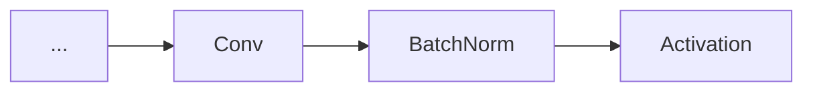
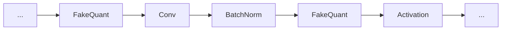

# 从 0 到 1 部署 PyTorch QAT 训练

切换到分支：axera-yolov5-qat

## 0X01 简介

本篇介绍的 QAT 训练是基于 PyTorch 训练框架中的 Eager Mode 方式。QAT是以插入 Fake Quant Node 的方法介入到训练前期模型的训练。

原始 Graph 中的简单结构：

经过插入FakeQuantNode之后 Graph 的简单结构

后续文章中所介绍的是如何在原有框架中以自定义的方式对每一层 Layer，Struct 增删 FakeQuant Node 来满足训练需求。

## 0X02 文件以及API介绍

本次修改基于官方的yolov5的PyTorch github 开源训练代码：
https://github.com/ultralytics/yolov5
- 所介绍到的API只涉及本次修改相关 torch quantization 有多种 API 设置，如有兴趣可自行拓展学习

##### 0X0a torch中所涉及 API 简介

```
torch.ao.quantization                   # torch 量化模块包
torch.ao.quantization.QConfig()         # FakeQuant Node 的量化策略设置 Config 文件
torch.ao.quantization.FakeQuantize()    # QConfig 设置相关 API
torch.quantization.prepare_qat()        # QAT 训练接口
torch.quantization.QuantStub()          # Layer中设置指定量化
torch.ao.quantization.DeQuantStub()     # Layer中设置指定量化
```
主要 torch quantization API 资料连接：
https://pytorch.org/docs/stable/quantization-support.html

##### 0X0b YoloV5 训练相关文件介绍
```
- yolov5s_qat.yaml        模型结构设置文件
- train.py            模型训练入口文件
- models/yolo.py      yolo模型结构入口文件
- models/common.py    普通 Layer 结构设置 （注：主要量化设置在此文件）
- export_qat.py           导出 onnx 模型文件修改
```

## 0X03 训练文件设置

标准的 prepare_qat API 设置可参考torch官方链接：
https://pytorch.org/docs/stable/quantization.html 中的 Eager Mode Quantization - QAT API Example 章节

##### 0X0a train.py 设置
Yolov5 中的 train.py 中在加载 pretrain weights 部分之后添加如下代码：
```
...
    import torch.ao.quantization as quantizer

    activation_quant = quantizer.FakeQuantize.with_args(
                observer=quantizer.MovingAverageMinMaxObserver.with_args(dtype=torch.quint8), 
                quant_min=0, quant_max=255, dtype=torch.quint8, qscheme=torch.per_tensor_affine, reduce_range=False)
    weight_quant = quantizer.FakeQuantize.with_args(
                observer=quantizer.MovingAveragePerChannelMinMaxObserver.with_args(dtype=torch.qint8), 
                quant_min=-128, quant_max=127, dtype=torch.qint8, qscheme=torch.per_channel_symmetric, reduce_range=False)         


    qconfig = quantizer.QConfig(activation=activation_quant, weight=weight_quant)
    model.qconfig = qconfig
    model.train()
    model.simple(quantizer)
    torch.quantization.prepare_qat(model, inplace=True)
...
通过多个 epoch 训练之后，保存 ckpt 文件需要把模型保存成state_dict类型
···
    ckpt = {
        'epoch': epoch,
        'best_fitness': best_fitness,
        # 'model': deepcopy(de_parallel(model)).half(),
        # 'ema': deepcopy(ema.ema).half(),
        # 'updates': ema.updates,
        'model': deepcopy(de_parallel(model)).half().state_dict(),
        'optimizer': optimizer.state_dict(),
        'opt': vars(opt),
        # 'git': GIT_INFO,  # {remote, branch, commit} if a git repo
        'date': datetime.now().isoformat()
    }
···
```
- 注意：在设置 prepare_qat 之前必须先 model.train()一次

对于模型部署，本篇章是最终导出保存成 onnx 模型格式，由于 ckpt 是以 state_dict 的类型进行参数保存，通过调用原始的读取方式是不能对此类型模型进行调用，所以需要修改部分 export.py 代码直接进行onnx的导出

```
    if RANK in {-1, 0}:
        LOGGER.info(f"\n{epoch - start_epoch + 1} epochs completed in {(time.time() - t0) / 3600:.3f} hours.")
        for f in last, best:
            if f.exists():
                strip_optimizer(f)  # strip optimizers
                if f is best:
                    LOGGER.info(f"\nValidating {f}...")
                    results, _, _ = validate.run(
                        data_dict,
                        batch_size=batch_size // WORLD_SIZE * 2,
                        imgsz=imgsz,
                        model=model,#attempt_load(f, device).half(),
                        iou_thres=0.65 if is_coco else 0.60,  # best pycocotools at iou 0.65
                        single_cls=single_cls,
                        dataloader=val_loader,
                        save_dir=save_dir,
                        save_json=is_coco,
                        verbose=True,
                        plots=plots,
                        callbacks=callbacks,
                        compute_loss=compute_loss,
                    )  # val best model with plots
                    if is_coco:
                        callbacks.run("on_fit_epoch_end", list(mloss) + list(results) + lr, epoch, best_fitness, fi)

        callbacks.run("on_train_end", last, best, epoch, results)

    import export_qat as ep

    ep.run(model=model, include=['onnx'],device="cpu")
```
通过修改 validate.run 中的 model = model 以及最后直接调用 export 中的 run api 可以避免调用保存成 state_dict 的 pt 模型，直接使用训练以后的 model 变量进行导出，对应的 export.py 修改如下：
```
在run函数中：
···
if model == None:
        model = attempt_load(weights, device=device, inplace=True, fuse=True)
    else:
        model = model
···
```
通过上述修改，可直接导出 yolov5s.onnx 模型

##### 0X0b FakeQuant 的添加

##### 0X0a 首先修改 yolo.py 文件：

对于 Detect Class，添加：
```
        self.register_buffer('anchors', torch.tensor(anchors).float().view(self.nl, -1, 2))  # shape(nl,na,2)
        self.m = nn.ModuleList(nn.Conv2d(x, self.no * self.na, 1) for x in ch)  # output conv
        self.inplace = inplace  # use inplace ops (e.g. slice assignment)

        self.dequant0 = torch.ao.quantization.DeQuantStub()
        self.dequant1 = torch.ao.quantization.DeQuantStub()
        self.dequant2 = torch.ao.quantization.DeQuantStub()

    def forward(self, x):
        z = []  # inference output
        for i in range(self.nl):
            x[i] = self.m[i](x[i])  # conv

            if i == 0:
                x[i] = self.dequant0(x[i])
            elif i == 1:
                x[i] = self.dequant1(x[i])
            elif i == 2:
                x[i] = self.dequant2(x[i])

            bs, _, ny, nx = x[i].shape  # x(bs,255,20,20）
```
torch.ao.quantzation.DeQuantStub 对于 Detect 结构的输入数据进行量化设置

在 DetectionModel的forward函数中添加：
```
    self.quant = torch.ao.quantization.QuantStub()
    def forward(self, x, augment=False, profile=False, visualize=False):

        x = self.quant(x)

        if augment:
            return self._forward_augment(x)  # augmented inference, None
        return self._forward_once(x, profile, visualize)  # single-scale inference, train
```
此操作是为了设置 DetectionModel 的输入量化设置

##### 0X0b 修改 common.py 文件 对应 Layer 修改：

Conv Layer： Conv为基础算子，对于 Conv的修改如下
```
class Conv(nn.Module):
    # Standard convolution with args(ch_in, ch_out, kernel, stride, padding, groups, dilation, activation)
    default_act = nn.SiLU()  # default activation

    def __init__(self, c1, c2, k=1, s=1, p=None, g=1, d=1, act=True):
        """Initializes a standard convolution layer with optional batch normalization and activation."""
        super().__init__()
        self.conv = nn.Conv2d(c1, c2, k, s, autopad(k, p, d), groups=g, dilation=d, bias=False)
        self.bn = nn.BatchNorm2d(c2)
        self.act = self.default_act if act is True else act if isinstance(act, nn.Module) else nn.Identity()
        self.quant = torch.ao.quantization.QuantStub()
        
    def forward(self, x):
        """Applies a convolution followed by batch normalization and an activation function to the input tensor `x`."""
        conv_out = self.conv(x)
        bn_out = self.bn(conv_out)
        act_out = self.act(bn_out)        
        return self.quant(act_out)
```
主要修改集中于 forward 函数，因为在模型结构中，主要是对Layer的输出层进行量化设置，所以只需要对返回值进行 self.quant(...) 的操作，就可以对对应Layer中的数据进行量化操作，计算scale与zeropoint并存入到 QConfig 的 Tensor 中，后续的 Layer 操作可以参考 Conv 算子，如果需要对 Layer 的输入进行 量化设置，则可直接 x = self.quant(x)

起初在 train.py 中 prepare_qat 对 QConfig 的设置，只针对最上一级的 Layer 以及同级的结构如Focus进行 量化与反量化的设置，涉及到 Focus 中的sub Layer，则需要在Focus中对输入输出进行单独设置。类似 Focus 中的修改，也可参照 Conv 的修改

##### 0X0c 修改模型结构的修改：

对于有特殊需求的，则需要对模型结构进行修改。如在原有的 yaml 文件中，resize 采用了 torch.nn.upsample 进行设置，但是如果需要增加量化封包，则需要对 nn.upsample 进行 Class 的封装，在 Class 结构中添加量化反量化接口
yolo.py 文件中添加 Resize 
```
class Resize(nn.Module):
    # Ghost Convolution https://github.com/huawei-noah/ghostnet
    def __init__(self, c1, c2, k=1, s=1, g=1, act=True):
        """Initializes GhostConv with in/out channels, kernel size, stride, groups, and activation; halves out channels
        for efficiency.
        """
        super().__init__()
        self.resize = nn.Upsample(scale_factor=2, mode='nearest')
        self.quant = torch.quantization.QuantStub()
        
    def forward(self, x):
        """Performs forward pass, concatenating outputs of two convolutions on input `x`: shape (B,C,H,W)."""
        x = self.quant(x)
        y = self.resize(x)
        return self.quant(y)
```
并同时在调用模型结构中增加判断
```
    elif m is Contract:
        c2 = ch[f] * args[0] ** 2
    elif m is Expand:
        c2 = ch[f] // args[0] ** 2
    elif m is nn.Upsample:  # 如果检测到是 upsample，则替换为 Resize
        m = Resize
        c2 = ch[f]
    else:
        c2 = ch[f]

```
另对于需要输入输出量化设置的透传，也需要对模型结构中的Layer层算子进行量化修改，具体代码课参见 ConcatX 以及 ConvR 这两个新增Layer

##### 0X0d FakeQuant 的修改

前文说到 prepare_qat是对模型结构中最上层的Layer进行FakeQuant Node 的自动添加， 如果对于需要剔除原有的FakeQuant Node设置，可以对指定 Layer 结构的 QConfig 进行设置：
在yolo.py中：
```
    def simple(self, quantizer):
        activation_quant = quantizer.FakeQuantize.with_args(
                    observer=quantizer.MovingAverageMinMaxObserver.with_args(dtype=torch.quint8), 
                    quant_min=0, quant_max=255, dtype=torch.quint8, qscheme=torch.per_tensor_affine, reduce_range=False)
        weight_quant = quantizer.FakeQuantize.with_args(
                    observer=quantizer.MovingAveragePerChannelMinMaxObserver.with_args(dtype=torch.qint8), 
                    quant_min=-128, quant_max=127, dtype=torch.qint8, qscheme=torch.per_channel_symmetric, reduce_range=False)         

        for node in self.modules():
            if type(node) == Conv or type(node) == ConvR:
                if isinstance(node, (Conv, DWConv, ConvR)) and hasattr(node, "bn"):
                    qconfig = quantizer.QConfig(activation=torch.nn.Identity, weight=weight_quant)
                    node.conv.qconfig = qconfig
            if type(node) == nn.Upsample:
                qconfig = quantizer.QConfig(activation=activation_quant, weight=weight_quant)
                node.qconfig = qconfig
            if type(node) == SPPF:
                if type(node.cv1) == ConvR:
                    qconfig = quantizer.QConfig(activation=torch.nn.Identity, weight=weight_quant)
                    node.cv1.conv.qconfig = qconfig

 
```
在prepare_qat API设置之前添加 model.simple function。把 QConfig 中的 activation 设置成 torch.nn.Identity，即可对此路输出进行bypass设置。


##### 0X0e 训练
训练采用GPU
首先需要加载预训练模型 yolov5s.py
```
python3 train.py --data coco128.yaml --weights yolov5s.pt --batch-size 64 --device 1 --cfg yolov5s_qat.yaml
```

上述就是对 yolov5 训练侧添加 qdq 算子的初步简介

注：其余模型格式等小问题不在此做阐述，本介绍专注 QAT 训练的 qdq 算子插入